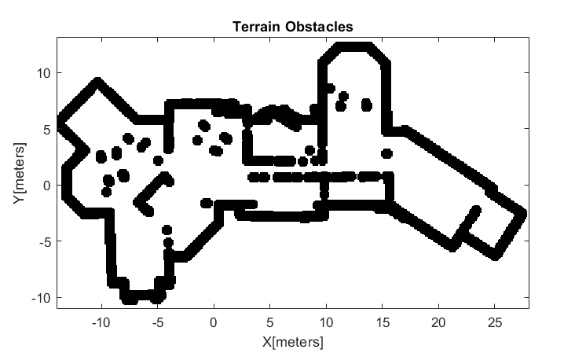
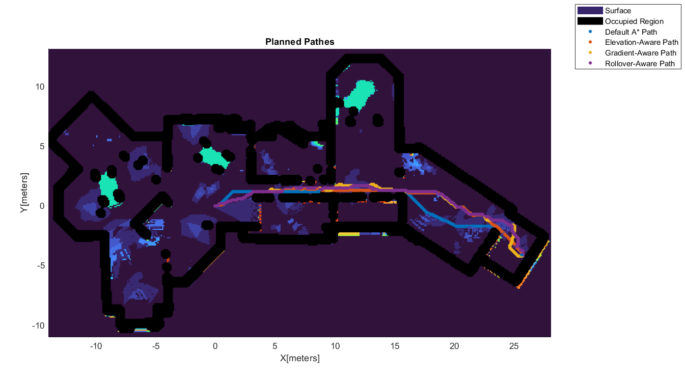

# Autonomous Robot Navigation in Rough Terrain

## Author
Yujie Wang (ucab211@ucl.ac.uk)

## Overview
The aim of this project is to demo a husky robot working in a construction site, moving from point A to point B.The construction site has minor bumps and obstables. The path is planned using MATLAB, and the control is realised by Simulink-Gazebo co-simulation. The husky robot is equipped with the following sensors: 

• A Realsense D435 depth camera

• A Hokuyo UST10 lidar

<div style="display: flex; justify-content: center;">
  
</div>

## Motivation
The existing method for on-road robot automation often involves finding the shortest path for a wheeled robot in the presence of obstacles. The planner often assume that the planning space is a 2-D Cartesian plane, with certain regions marked as off limits due to the presence of obstacles. However, when it comes to offroad vehicles, environments can also contain changes in elevation, turning this into a 3-dimensional problem. Compared to on-road vehicle automation, off-road autonomous driving faces the following additional challenges:

• Lack of road rules

• Distinguish between slopes and obstacles

• Wheels slippery

## Methods
### 1. Mapping
The tutorial of how to build the robot and map the evironment is [here](./src/readme.md).

Save the 2D occupency map and the 3D octomap to a .pgm file and a .bt file, respectively.


### 2. Planning
The path planned using A* based on the 3D terrain cost and the 2D occupency map. The following function can be realised by running the Matlab file modelling.slx and planning.slx.

Firstly, we import the saved 3D octomap (.bt file) and transfer it into a digital elevation map (DEM).
<div style="display: flex; justify-content: space-between;">
  
</div>

Based on the DEM, we obtain the terrain slope map. We can also obtain the terrain obstacle map based on the 2D occupency map (.pgm file).
<div style="display: flex; justify-content: space-between;">
  
  
</div>

Finally, we combine the terrain slope map and the terrain obstacle map into a general cost map. We use A* and other cost-aware algorithms to planned the pathes.

<div style="display: flex; justify-content: space-between;">
  
</div>


### 3. Controlling

In the Linux environment, start the gazebo simulation.
```
source devel/setup.bash
roslaunch cpr_office_gazebo office_construction_world.launch platform:=husky
```
The above launch file will also run the amcl localization node.

Establish the Simulink-Gazebo co-simulation by looking at this [tutorial](https://uk.mathworks.com/help/robotics/ug/perform-co-simulation-between-simulink-and-gazebo.html).  Then run the Simulink controller model ./OffroadPlanning/controlling.slx

If the co-simulation connection is established properly, you will see the husky robot moving along the planned path.

## Result

There is a video demonstrating the whole project.

<a href="https://youtu.be/zRUjdgBzka8" target="_blank"></a>

## Evaluation
<div style="display: flex; justify-content: center;">
  
</div>

## Reference
[1] [Clearpath Husky](https://github.com/husky/husky)

[2] [Offroad Planning with Digital Elevation Models](https://ww2.mathworks.cn/help/nav/ug/offorad-planning-on-digital-elevation-models.html)

[3] [Path Following with Obstacle Avoidance in Simulink®](https://ww2.mathworks.cn/help/nav/ug/path-following-with-obstacle-avoidance-in-simulink.html)
